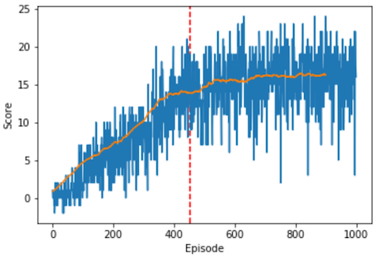

[//]: # (Image References)
# Implementation 
The [DRLND Banana environment](https://github.com/udacity/deep-reinforcement-learning/tree/master/p1_navigation) 
is solved in the repository via an implementation of a Double DQN Network with no further modifications, such as 
prioritized experience replay or dueling architectures. 

## Performance

Blue represents the score per episode, while the orange line is the moving average. After 454 episodes of training, the 
agent has solved the environment by having an average score > +13.0 over 100 consecutive episodes. After 1000 episodes,
the agent has an average score of +16.5. Running the agent for an additional 100 episodes without training gives an 
average score of +16.4. 

## Neural Network
A typical Feed-Forward Network is used for Q estimates. It has the following properties:
* ReLU activations
* 2 hidden layers [37 inputs -> 128 nodes -> 64 nodes-> 4 outputs]

Also tested was a small ResNet (6 layers), though this made no significant difference.
## Hyper-parameters
| Hyper-param | Value | Description |
| ----------- | ----- | ----------- |
| BUFFER_SIZE | 10000 | replay buffer size |
| BATCH_SIZE | 64 | minibatch size |
| GAMMA | 0.99 | discount factor |
| TAU | 0.001 | coefficient for soft update of target network parameters
| LR | 0.0001 | optimizer learning rate |
| UPDATE_EVERY | 4 | copy local network parameters to target parameters after this many steps |
| epsilon | 1.0 | Initial epsilon-greedy value |
| epsilon decay | 0.995 | Decay rate of epsilon while training |
| epsilon minimum | 0.01 | Minimum epsilon value |
| episodes | 1000 | Train for 1000 episodes |
 

## Future Work
Adding typical further improvements to the DQN network to convert it into a Rainbow network would almost 
certainly improve the training time and performance of the algorithm. DRLND suggests:
* Prioritized Experience Replay
* Dueling Networks
* Noisy DQN
* Distributional DQN
* Multi-step bootstrap targets  

I also suspect that a deeper ResNet implementation would be beneficial. Furthermore, a rigorous hyper-parameter 
search was not performed. Creating an experiment runner to handle randomizing the hyper-parameters and storing 
the results for analysis could result in a more optimal set of weights.
 